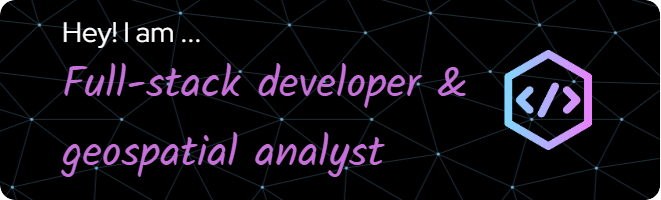

  <ul align="center" style="list-style: none">
    

      <h1>
        👋 Hi, my name is Courage Kumawu
      </h1>
    

  </ul>

**<h3 align="left">Connect with me:</h3>** 

  

<h3 align="left">🚀I am a passionate Geospatial Data Scientist specializing in GIS, Remote Sensing, Geospatial AI, and Spatial Data Science. With a background in Geomatic Engineering and a focus on leveraging data for impactful spatial analysis, I love exploring how technology, data, and geography intersect to solve complex, real-world problems.

My interest spans a wide range of geospatial disciplines:

🌐 Developing scalable spatial algorithms for high-resolution mapping and analysis
📊 Utilizing machine learning and AI to uncover patterns in geospatial data
🛰️ Applying remote sensing and GIS to urban planning and environmental management
💻 Building with Python, R, and SQL to create data-driven insights and applications
I'm driven by a curiosity to understand spatial dynamics and a commitment to open-source development.
Feel free to explore my repositories, contribute, or reach out—let’s make an impact with geospatial tech! 🌍</h3> 

**<h3 align="left">Rapid Fire</h3>**

- 💼 I'm currently working on: **💻projects that involve geospatial big data, urban informatics, and high-performance computing for spatial analysis.**
- 🌱 I'm currently learning: **📚 Mastering Machine Learning with Python in Six Steps**
- 💬 Ask me about: **How geospatial data can solve real-world problems?**

 **<h3 align="left">Skills</h3>**

      

